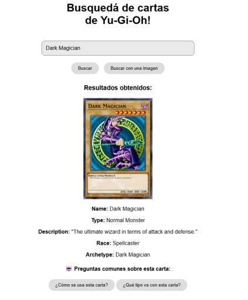
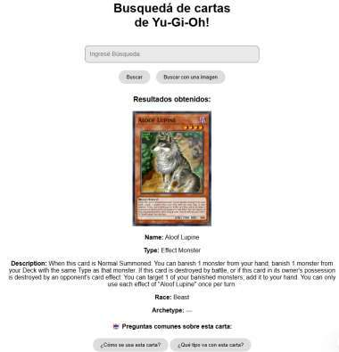

# Buscador de cartas Yu-Gi-Oh! por texto e imagen

Aplicación académica de recuperación multimodal. Busca cartas por nombre o descripción con embeddings de texto y utiliza CLIP para encontrar una carta visualmente similar a una imagen. Muestra la carta principal y otras relacionadas en una interfaz web.

## Capturas del informe original

Búsqueda por texto y por imagen, extraídas de Grupo8_Informe_ProyectoIIB.pdf. Corresponden a la versión académica original; la demo actual usa descripciones reales del catálogo y requiere configurar Gemini para las respuestas generativas.





## Cómo funciona

1. Descarga metadatos e imágenes desde YGOPRODeck y los guarda localmente.
2. Crea embeddings visuales con `openai/clip-vit-base-patch32` y un índice FAISS.
3. El buscador de texto genera embeddings con `all-MiniLM-L6-v2` al iniciar.
4. Flask expone la búsqueda y sirve las imágenes; JavaScript presenta los resultados.
5. Opcionalmente Gemini resume la descripción. Sin una clave y un modelo configurados, se muestra la descripción original y la búsqueda funciona igual.

## Repositorio liviano

GitHub contiene código, dependencias y pasos de preparación. Las imágenes, metadatos, índices FAISS, archivos pickle y modelos descargados se crean en la computadora del usuario y no se suben. No necesitas subir un ZIP grande ni las miles de cartas.

## Estructura

```text
backend/
  cards_downloader.py          Descarga imágenes y descripciones reales
  build_all_faiss_indexes.py    Prepara metadatos e índice de imágenes
  search_text.py               Búsqueda semántica y por nombre
  search_image_clip.py         Consulta visual con CLIP
  api.py                       API Flask
  data/cartas/                 Imágenes generadas localmente
frontend/                      Interfaz HTML, CSS y JavaScript
requirements.txt
.env.example
```

## 1. Instalar

Se recomienda Python 3.11. Desde la raíz:

```bash
python -m venv .venv
# Windows PowerShell:
.venv/Scripts/Activate.ps1
# Linux/macOS:
# source .venv/bin/activate
python -m pip install -r requirements.txt
```

## 2. Descargar una muestra y generar índices

```bash
python backend/cards_downloader.py --limit 100
python backend/build_all_faiss_indexes.py
```

Para una colección mayor, cambia `100` por `2000` y vuelve a construir los índices. La primera preparación necesita Internet para los datos y modelos; consume espacio y puede tardar varios minutos o más según la computadora. La descarga reutiliza archivos locales y espera entre imágenes. YGOPRODeck es un proveedor externo, no una API oficial de Konami: [guía de su API](https://api.ygoprodeck.com/api-guide/).

## 3. Iniciar el backend

```bash
python backend/api.py
```

La API escucha en http://127.0.0.1:5000. En otra terminal, con el entorno virtual activado:

```bash
python -m http.server 5500 --directory frontend
```

Abre http://127.0.0.1:5500. Busca por el nombre de una carta que aparezca en `backend/data/cards.json`, por una descripción en inglés o sube una imagen de prueba. Una muestra de 100 cartas solo puede recuperar cartas de esa muestra.

## Resúmenes opcionales con Gemini

Configura en PowerShell una clave propia y el identificador de un modelo disponible en tu cuenta:

```powershell
$env:GOOGLE_API_KEY="TU_CLAVE"
$env:GEMINI_MODEL="IDENTIFICADOR_DEL_MODELO"
python backend/api.py
```

En Linux/macOS usa `export GOOGLE_API_KEY=...` y `export GEMINI_MODEL=...`. `.env.example` solo documenta las variables; el servidor las lee del entorno. Si activas esta opción, se envía a Google la descripción pública de la carta solicitada y puede consumir cuota o generar cargos según tu cuenta.

## Limitaciones y créditos

Prototipo local, no servicio de producción. La similitud visual no garantiza identificación exacta. Los resultados dependen de la colección descargada; las imágenes fallidas se excluyen del índice para mantener alineados nombres y vectores. Los modelos externos se descargan por sus bibliotecas y conservan sus condiciones. Yu-Gi-Oh!, las cartas y sus imágenes pertenecen a sus titulares; este proyecto no está afiliado a Konami. Se acredita YGOPRODeck por los datos y servicios.

Trabajo académico del Grupo 8: Wilson Inga, Anthony Reinoso y Sergio Vite. Proyecto publicado en el portafolio de [Anthony Reinoso](https://github.com/TAnthonyR). `build_faiss_index.py` y `generate_clip_index.py` son variantes históricas; el procedimiento principal utiliza `build_all_faiss_indexes.py`.

## Tamaño e historial

El árbol actual contiene código y capturas de muestra. Las imágenes e índices antiguos siguen recuperables en el historial. Para descargar únicamente la versión reciente usa `git clone --depth 1 https://github.com/TAnthonyR/Proyecto-IIB.git`.
